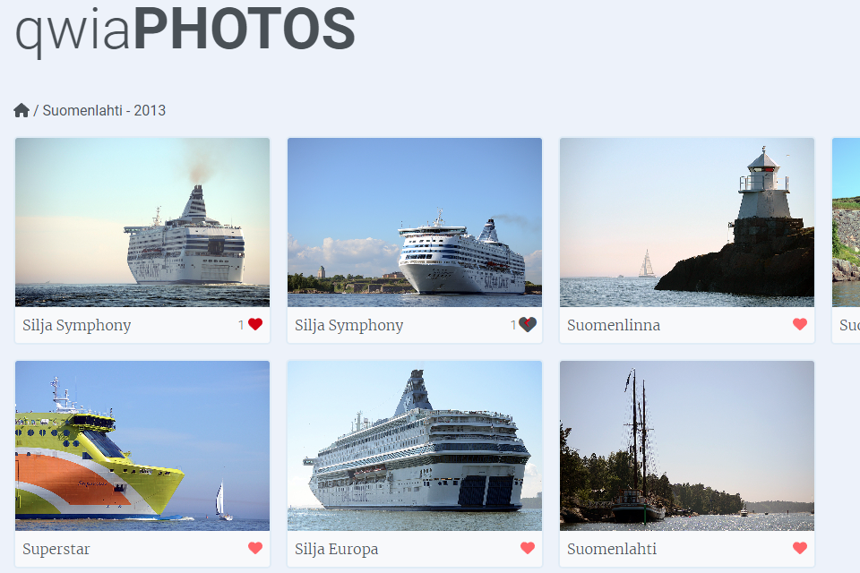

# qwiaPHOTOS

This is my latest full stack MERN project. It is currently under development. Basic functionalities are working. Admin can add albums, add photos to albums, change album or photo title and also remove albums or photos. Photos are saved to AWS S3 and authentication is made with Auth0.

Visitors can view uploaded photos and gave likes to them. Album thumbnail is chosen by the most liked photo.

